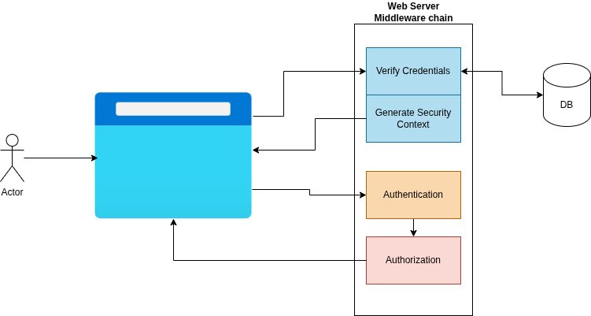
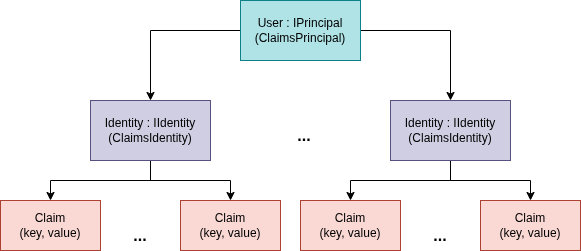
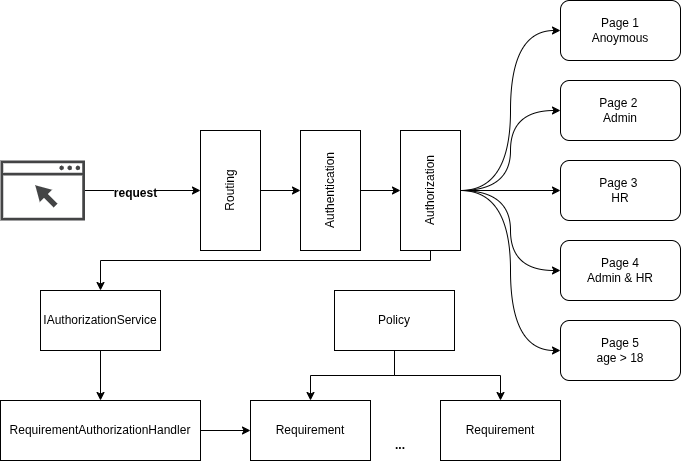

# Security in ASP NET

# Introduction

In every request the security context is verified (authenticated) by middlewares, filter, etc.
Cookies are used mainly for session management, personalization and tracking.

## Security Context

All security-related information/data that is relevant to security like: name, user identification, roles, etc.

## Authentication

Verify if you are who you say you are, implies to generate security context.

## Authorization
Verify if security context satisfies the access requirements.

# ASP NET Core Security Basics

The middleware follow the chain-of-responsabilities pattern, to deal with all things in the pipeline 
— authenticatio, authorization, other handlers.

The main concept in ASP NET is the **ClaimsPrincipal** representing the security context, that can have one or more
identities (having a default one). If not logged, identity is anonymous.

Browser session can affect the cookie lifetime (how the session is managed is specific per browser implementation). The cookie can expire together with browser session or lasts more (persistent cookie).\
====Browser Lifetime===== | == Browser Lifetime ==             
=================== Cookie Lifetime ==========================

## Authentication
The middleware will check if has the cookie, is valid, descrypt and populate the security context.

## Authorization

When some action needs to be performed in specific pages the **IAuthorizationService** will find all
requirement handlers that deal with those requirement of that action. 

